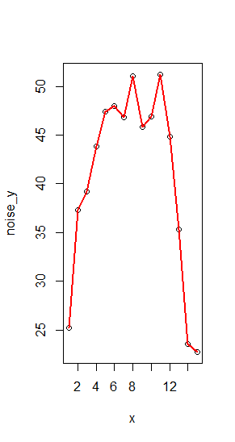
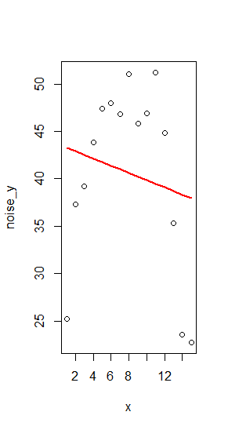

# Neural Networks {#math-sci}

<!-- Required to number equations in HTML files -->
<script type="text/x-mathjax-config">
MathJax.Hub.Config({
  TeX: { equationNumbers: { autoNumber: "AMS" } }
});
</script>

## Introduction to Machine Learning

> From the advent of computation, there has been a drive towards automation. [@goodfellow2016deep]

The capacity to derive patterns from raw data is known as machine learning, a broad term for an extremely diverse collection of algorithms. Machine learning flips the script on classical programming: whereas classical programming takes rules and data to produce answers, machine learning creates rules from data and answers by being "trained rather than explicitly programmed. It's presented with many examples relevant to a task, and it finds a structure that derives rules for automating the task" [@chollet2018deep].

Machine learning is intended to elucidate or predict patterns in data. These algorithms handle anything from linear regression for predicting a numerical response based on a number of features, to clustering for visualization and assignment of untaught observation classes. Machine learning models are trained by minimizing error during exposure to labelled "training" data with some underlying distribution and random noise. After training, models are passed unlabelled "test" data to predict the corresponding unknown class or value. Predictive (supervised) machine learning algorithms seek to emulate and elucidate a true unknown generative function from which the data were drawn.

For imputation purposes, our goal will be to accurately estimate missing values by approximating the generative function from which they are drawn. Generative functions are of the form
$$
y = f(x_1, x_2, \dots, x_n) + \epsilon
$$
where the true label $y$ of the observation is a function of the features $x_1, ..., x_n$ perturbed by some random noise $\epsilon$.

The estimating model will be trained via exposure to labelled observations, called the training data, then used to predict observations with missing labels, called testing data. The challenge in machine learning is learning the correct amount from training data in order to derive the underlying distribution of the observations without simply memorizing the labels of the training set. This memorizaion problem is called overfitting and is central to machine learning.

\@ref(fig:overfit) is an illustration of this pervasive principle in a regression example. An overfit (or too-flexible) model simply learns the observation's labels, rather than the underlying distribution (or generative function, in this case a second-degree polynomial). The overfit model fails to learn the underlying generative function, and instead learns the random noise of the training observations, and thus is a poor explanation of a new realization from the same generative function, seen in \@ref(fig:overfit) and \@ref(fig:overfitre):

```{r overfit, echo = FALSE, fig.cap = "The overfit model has extremely low error on the realization of the data on which it was trained."}

```

```{r overfitre, echo = FALSE, fig.cap = "The overfit model does not accurately reflect the underlying distribution from which both datasets are drawn. Rather, it captures only the random noise of the data on which it was trained. It would be a mistake to assume the generative function is a degree 15 polynomial just because the training error of such a function is low."}

```

An underfit model, \@ref(fig:underfit), also fails to capture the underlying distribution, due to a lack of flexibility. A linear regression, though it minimizes its training MSE, clearly fails to capture the underlying distribution of the data:

```{r underfit, echo = FALSE, fig.cap = "An underfit model fails to capture the underlying distribution"}


```

\@ref(fig:goodmod) displays a well-trained model which straddles these extrema and captures the apparent underlying distribution of the data in a general sense by approximating the generative function from which they are drawn, and remains fairly constant under different draws from the same distribution. The aptly-flexible model has consistent performance on new realizations of the data. The model performing well on data it was not trained on is called generalizability.

```{r goodmod, echo = FALSE, fig.cap = "This model has the correct level of flexibility, and accurately captures the underlying generative function while avoiding overtraining based on noise."}
a <- knitr::include_graphics("figure/true.png")
```
```{r, echo = FALSE}
b <- knitr::include_graphics("figure/stayGood.png")
```

```{r biasvar, echo = FALSE, fig.cap = "The bias-variance tradeoff"}
knitr::include_graphics("figure/biasvariance.png")
```
Fortmann, Scott. “Bias and Variance.” Understanding the Bias-Variance Tradeoff, June 2012, scott.fortmann-roe.com/docs/BiasVariance.html.

Figure \@ref(fig:biasvar) demonstrates the involvement of model complexity (or flexibility) in terms of training error. Model complexity refers to the ability of the model to approximate complex generative functions. We see that as the flexibility of the model increases, the bias on the training set always decreases, representing the model's performance on observations with labels. However, complexity beyond the models optimal value implies over-flexibility, in which the model is able to memorize random noise rather than stopping at the trend of the data. This increases the total error of the model when exposed to data that comes from the same generative function that the model has not been exposed to, such as a testing data set or another observation from outside the training set. Higher flexibility models create more variable models, which though trained on data from the same generative function differ greatly in appearance due to the random sample of training data. These models are unstable for inference and generalize poorly. 

One key difference from statistical modelling and survey statistics methods is the point at which randomness is introduced into the data. Machine learning attempts to approximate the function from which the data was randomly generated, while survey statistics imply that randomness in data comes from the survey design. The paradox of where randomness is introduced into the data is resolved with the existence of a superpopulation $U$, where each observation has label $y = f(x) + \epsilon$, some generative function. From this superpopulation, a population $u$ is created through *i.i.d.* realizations from $U$. From this population $u$, the survey is taken. Thus there still exists a generative function from which the population is drawn, but the features and label of the observations are fixed by the time the complex survey is taken on the population, reconciling the two methodologies.

## Neural Networks
### Background and Context
Neural networks are a family of machine learning algorithms with an extended and diverse history of research in neuroscience, statistics, and computer science. Recently, these models have experienced great growth in attention and popularity due to the contemporary circumstance of computational capability. Neural networks thrive on large training data sets, which have tended to increase in size and availability throughout time. Neural networks also outperform competing algorithms in high-dimension feature problems, which are common in real-world machine learning applications such as image data, waveform data, and large surveys. Often utilizing derivatives of complex compositions of functions as an optimization method, deep learning training periods are computationally intensive, relying heavily on computer hardware and optimized software for reasonable implementation. Lastly, recent attention to and development of neural networks can be attributed to their proven potential in solving complicated real-world applications with promising and increasingly dominant accuracy in practice, often at the cost of a lack of inferability.

This lack of inferability is the typical downside of working with neural networks as the inference on a model can be more important than the predictive accuracy depending on the problem. Once a simple linear regression is trained, the coefficients on the predictors offer an immediately understandable interpretation of the behavior of the data. For example, a coefficient of .3 on a feature $x$ has a simple, instant understanding: as feature $x$ goes up by 1, the response goes up by .3. Neural networks however, lack this instant recognition due to the less intuitive layered structure of input transformations, known as representation learning.

### Basics
Neural Networks are a composition of functions. The following describes a full neural network:

$$
\hat y = f(\boldsymbol{x}; \theta, \omega) = f^n ( f^{n-1}  ( ... f^1(\boldsymbol{x}; \theta, \omega)))
$$
In this function, we see the input features $x \in \mathbb{R}^n$, the learned coefficients $\theta$, the learning rate $\omega \in \mathbb{R}$, and the output prediction $\hat{y}$.
Consider one of the layers of the network, $f^i$. This layer is an activation function composed with a linear function:

$$
f^i = \max ( 0 , {\boldsymbol{W}_i}^T \boldsymbol{x} + c_i)
$$
Where $\boldsymbol{W}_i^T \boldsymbol{x} + c_i$ is the interior linear function for $\boldsymbol{W}_i^T \in \mathbb{R}^n$, $c_i \in \mathbb{R}$.

The activation function shown above is the rectified linear unit, or $\max(0,a)$. Activation functions are significant as they introduce nonlinearity into what would otherwise be a linear function (a composition of linear functions).
${W_i}^T$ and $c$ in $f_i$ dictate a linear transformation on the input to the layer. An ordered list of all elements of $W_i$ and $c_i$ for all $i \in n$ would give the full description of the network, called $\theta$. So the output of a  1-layer network can be expressed as

$$
f(x; W, c, w, b) = w^T \max( 0 , \boldsymbol{W}^T \boldsymbol{x} +c ) +b
$$

The final activation function is another structural parameter left to the designer of the network, but differs from interior activation functions as the output of the network is restricted to the codomain of the function, limiting the number of reasonable choices. The typical output layer for scalar regression is a linear unit, on behalf of the codomain $(-\infty,\infty)$ of the activation:
$$
f^n(\boldsymbol{x}) = 1*(\boldsymbol{W}_n^T \boldsymbol{x} + c_n)
$$

The learning rate $\omega$ and a loss function are meta-parameters, given by the user creating the neural network. These two parameters are used during the training of the network. During training, gradient descent is used to descend the loss function in order to find the optimal parameters for the network.

Loss functions are ways of describing the performance of a model when predicting labels of a data set. The loss function takes the model and data as inputs, and outputs a real number. Loss functions can be minimized in training by optimization which leads the network to find improvements in weights yielding accurate predictions. Loss functions allow for another degree of customization in the training of a network, such as in Ridge and LASSO regression. These algorithms add a weighting to the typical mean squared error loss function which penalizes the weights on predictors in polynomial regression. These methods introduce bias into otherwise unbiased algorithms, but reduce the variability of the model across different draws of data from the same distribution, aiming to reduce the real test loss and improve the model. The cross entropy between the data distribution and the model distribution is the typical choice [@goodfellow2016deep].

Cross Entropy:
$$
\int_\chi P(x) \log Q (x) dr(x) = E_p [- \log Q]
$$

Take for example the Mean Squared Error cost function:
$$
MSE = \frac{1}{n} \sum_{k=1}^n  (y - \hat y)
$$

MSE, a typical loss function for regression applications, takes the mean squared difference of the predicted label $\hat y$ and the true label $y$ of the observations.

```{r optimize, echo = FALSE, fig.cap = "A convex loss function", out.width= "70%"}
knitr::include_graphics("figure/optimize.png")
```

https://medium.com/@ageitgey/machine-learning-is-fun-80ea3ec3c471

CITE ME

We can see that the loss of a linear regression is a function of $m$ and $c$ given some data which is minimized at $m = 0$ and $c = 0$. The learning rate is the amount that the functions' coefficients are updated as the loss function is optimized from some initial coordinates in search of the minimum loss.

Much like training a linear regression, the training of the neural network aims to drive the approximating function to the underlying function. The important difference induced by nonparametric models, however, is the nonconvexity of the loss. The large amount of coefficients which define even a relatively small network complicate the optimization problem and make local minima a demanding distraction. Optimization is typically done with gradient learning using a loss function, or maximum likelihood estimation. Most modern neural networks are trained using maximum likelihood, in  which the cost function is the negative log-likelihood between the training data and model distribution [@goodfellow2016deep].

### Representation Learning
If you were handed a photograph and were asked if it contained a car, there's a good chance you would immediately know the answer. But how are you coming to this conclusion? The human mind recognizes patterns of the image it has seen before, like a round bumper, a rectangular windshield, and a few circular tires with a certain spatial relationship to come to the conclusion that there is, in fact, a car in the photograph. It is this process of representation learning that prompted early researchers [[Citation Needed]] to create representation-based learning algorithms to extrapolate on information in the same way as the human mind. The emulation of human neural cells was the birth of deep learning, a class of machine learning algorithms which takes its name from multiple layers of connected nodes simulating a proposed structure of the neurons of the human mind. Representation learning takes observation's features as a first layer into a composition of functions, in which each layer (or function) transforms the data according to a learned representation transformation that the subsequent layer takes as an input. This composition allows for complex relationships of features to be learned in increasingly sophisticated ways, making neural networks ideal for large-dimensional datasets. For large-dimensional features, such as in Consumer Spending Data, images, or audio, these hierarchical representations (or layered representations) are important for distilling human-like feature extraction and iterative predictor space transformation. To achieve hierarchical representation properties, subsequent layers understand more complex functions of input variables as each layer transforms inputs and and weight relationships that minimize the overall loss of the network. As each layer receives the transformed output of the previous layer, more complex relationships of features can be derived.

Successive layers of the network learn transformed representations of the data which lend themselves to an effective linear regression performed by the final layer, called the output layer. This process of successive transformation learns meaningful representations on which the output layer can be most accurate. Since the full network does not have a single functional representation, it is nonparametric. The flexibility and power of neural networks in fields demanding domain knowledge is that they can approximate any function, per the Universal Approximation Theorem (Hornik et al., 1989; Cybenko, 1989). The theorem states that a feedforward network with a linear output layer and at least one hidden layer with any "squashing" activation function can approximate any function from one finite-dimensional space to another with any desired nonzero amount of error, provided that the network is given enough hidden units. Thus the user decision required is the depth and breadth of the network, optimized through validation set meta-analysis.

Representation learning is extremely important to the broad promises of neural networks in practice. The basis for this strength is that subsequent layers of the network learn meaningful structures of the input data associated with a lower loss score. Correlations of features forming a functional relationship to the label which induce loss function descent will be internalized by the composition of subsequent functions. This property of representation learning is significant for investigating the necessity of independent and identically distributed data in deep learning algorithms. Fo survey data, it could be the case that the significance of the inclusion probability can be learned as a meaningful feature, with no special tweaks or preprocessing necessary for the algorithm. Data which require no special tweeks are extremely meaningful as this circumvents the necessity of incorporating domain knowledge and expertise in current imputation methods, which holds back expedient and lightweight research.

These advantages of Hierarchical and Distributed Representation transformation give neural networks huge advantages in accuracy and fitting capability for data with a massive hypothesis space. A hypothesis space is the space of all possible answers to a question. Image classification, for instance, represents a hypothesis space of pixels with unknown correlations that must be trained with label relationships to determine the correct transformative relationsip of millions of pixels to a most-likely class label. Thus the curse of dimensionality common throughout machine learning is mitigated through successive transformation layers.

Neural networks thrive on the interaction of many features, due to the nature of representation learning which excels in covariate relations and distilling information encoded between features. Popular modern applications are image and waveform audio data, in which machine learning problems become dominated by the Curse of Dimensionality. This common machine learning problem arises when the amount of data is insignificant when compared to the hypothesis space or feature space, and there are sparse observations for some regions. Machine learning needs many observations with each combination of values, but this becomes quickly infeasible for data with thousands of features. The peaking phenomena dictates that there is an optimal number of features to describe the data before the curse of dimensionality creates problematic sparsity and dominating observations with few neighbors . Neural networks are known to resist this commonplace issue due to the distributed learning property, wherein each node is sensitive to only particular features.

Distributed representation is a powerful implicit component of neural networks in which neurons divide feature space to better handle feature interactions: suppose an image-recognition system could recognize cars, trucks, and birds, as well as distinguish if these objects are red, green, or blue. One way of representing these inputs could be to have a separate neuron for each combination: red truck, red car, red bird, and so on for nine independent neurons. Distributed representation, however, could partition these workloads by having three neurons for color and three for object type. In addition to reducing the number of neurons required dimensionally, this also distributes the learning demands of each neuron. The neuron describing redness is able to learn about redness from any category, not one specific category as the red bird neuron must [@goodfellow2016deep].

Neural networks approximate nonlinear functions by applying linear models not to the features x, but to a transformed input, $\phi(x)$, where $\phi$ is a nonlinear transformation. $\phi$ provides a new, more meaningful representation for $\boldsymbol{x}$. The question then is how to choose the mapping $\phi$:

1. One option is to manually engineer $\phi$. This takes a huge speciality of domain knowledge and practitioner specialization, with little transfer between domains. This was the dominant method before deep learning [@goodfellow2016deep].

2. The strategy of neural networks comes from the learning of $\phi$. In this approach, we have a  model $y = f(\boldsymbol{x}; \theta, \omega)$ as specified in the neural network introduction. Due to the Universal Approximation Theorem, the nonparametric deep feedforward network can learn a functional approximation from the input to the desired output. This method sacrifices the training convexity of the other two, but benefits from the genericity of the specifications. The human user need only specify a general function family rather than exactly the correct function, but can still benefit from designing families of $\phi(\boldsymbol{x}; \theta)$ that they expect to be relevant [@goodfellow2016deep].

### Neural Networks for Complex Survey Data

From an optimist's perspective, the need for data preprocessing or special conditions on the loss function for training the model would be unnecessary: If learning the correlations and underlying distributions associated with rare observations from complex survey design would truly lower the network's loss, it should be learned and accounted for without the need to perform special external transformations on the data to "undo" the effects of complex sample design. For this reason, it is significant to compare the potentially superior results of a naive model to one with superfluous data transformations done. A neural network model with access to an informative $\pi$ feature ideally would approximate the function relating the inclusion probability and features to labels, without the need for extreme domain knowledge and manual feature engineering.

The optimism of nonparametric algorithms increases in tasks of minimal domain knowledge and feature engineering capability. Ideally, using heuristic meta-parameters defining a neural network model would be enough to get reasonable predictive accuracy in conjunction with one of the methods of Chapter 3. Per the Universal Approximation Theorem, any underlying generative function is at worst approximated by a 2 layer heuristic model, potentially improving upon other naive modeling procedures such as a weighted linear regression. Additionally, in real survey data the capacity to derive the significant features from a high-dimensional space is a weakness of parametric model regression, which is highly variable in the context of the noisy features explored in Chapter 4.

