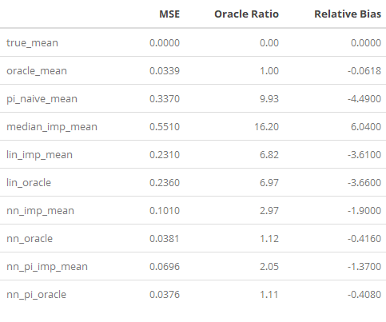

# Simulation

## Exploration of Methods Using Simulation
Simulated data is used to evaluate the methods in order to get an understanding of their performance on a data set with known characteristics.

Full insight into the feature distributions, generative function, random noise, and systematic missingness allow for controlled experimentation on when certain methods thrive. Simulation allows for parameters such as label noise and feature informativity to be changed and measure the response of the methods across any domain.

## High-Dimension Simulation
Often in real-world data, there might be a large number of features, not all of which are necessarily correlated to the response label. For example in the Consumer Expenditure data, age, gender, ethnicity, and education might have a predictive relationship with household income, while a number of others such as state, reference person gender, and social security income may not. The ability for a model to discern which features are relevant and which are not is a significant benefit both for inference and predictive consistency. Inspired by research in best feature selection methods, non-correlated features are used in the model evaluation step in an attempt to more realistically simulate complex data [@hastie2017extended]. The addition of these features contributes to the curse of dimensionality and variability of estimates.
 
These additional "noisy" parameters are simulated by making the generative function of the labels $y$ not a function of some of the features. All methods used in the simulation are accompanied by their oracle counterparts, meaning the same method is run two times: one with access to all features, the oracle restricted only to the relevant features which are inputs to the generative function.

## Monte Carlo Simulation
Monte Carlo (MC) simulation attempts to overcome the inherent randomness of sampling and model training by repeated iterations of the sampling, training, and evaluation steps. A distribution of output estimates is made over many potential samples from the population in order to get a more complete interpretation of the results.

It should be noted that neural networks can be more optimized than in their performance in the following simulation study. This is because a network can be intentionally over-trained on the training data, then re-trained from scratch to the number of epochs which minimized the validation loss. This poses a challenge in MC simulation, however, where many iterations without user input are needed. Additionally, runtime becomes a vastly greater concern when networks must be over-trained through many epochs, more than doubling the execution time. If computation were no expense, the neural network methods could be expected to be slightly more accurate than the below results. This is somewhat mitigated by a weighted sampling scheme with somewhat low observation variability and a strong signal between features and label.

## Creating a Simulated Population
The size of the population is $N=10^5$ and the sample is $n=10^3$ observations. Despite neural networks thriving in higher-dimension settings (both of features and observations), complex surveys are often implemented on real data with scarce observations, making a lower-size simulation more suitable for generalizability.

The features simulated population is made as the first step of the process. Two informative features $p_1, p_2$ are drawn from random uniform distribution:
$$
f(x) = \frac{1}{30+30} \text{ for } x \in (-30, 30)
$$
In addition to two informative features, there are $20$ uninformative features drawn from the normal distribution. This distribution is arbitrary but can have unintended consequences due to accidental correlation, noted in {@hastie2017extended}.

The population labels $y$ are a nonlinear function of the informative features:
$$
y = p_1^2 + p_2^2
$$
The labels are then made nonpolynomial by contorting the parabola into a "bowl with flat lip":
$$
y' = \left\{ \begin{array}{cc} 
                y & \hspace{5mm} y<\bar{y} \\
                \bar{y} & \hspace{5mm} y \geq \bar{y} \\
                \end{array} \right.
$$

```{r, echo = FALSE, out.width = "70%"}

```

Random noise $\epsilon$ with $\sigma = 1$ is then added to the transformed labels:
$$
y'' = y' + \epsilon_y
$$

An inclusion probability $pi$ is then assigned to each observation with a strong correlation to $y$, as well as random normal noise with $\sigma = 1$:
$$
\pi = \sqrt{y''} + \epsilon_\pi
$$
These values are then rescaled to (0,1) and rescaled so $\sum_i^N \pi_i = n$.

Combining the information $y,\pi, p_1, p_2$ and uncorrelated features gives the population on which the simulation will be performed. The true mean of the population labels $\mu_y$ is now known and recorded.

The Monte Carlo simulation is performed for 100 iterations. This is a low number of trials, but is constrained by the computation intensity of running 10 neural networks trained for hundreds of iterations each, as well as performing many weighted samples.

Within each iteration, a single estimation procedure is performed. First, a weighted sample from the population is taken with respect to the inclusion probabilities $\pi_i$ on each observation. From this sample of $n=10^3$ observations, an oracle data set is made by dropping the noise columns, keeping only $p_1, p_2, \pi,$ and $y$. This data set will be used as a benchmark to mirror each imputation method in order to gauge the potentially harmful effects of uninformative features common to real data.

The first step is to record the oracle mean, calculated using information the other methods are not privy to:
$$
\hat \mu_{\text{oracle}} = \frac{1}{n} \sum_{i=1}^n y_i \frac{1}{\pi_i}
$$

All subsequent methods are the methods of study, to be performed where there is missingness in the data. $20\%$ of the observations manually have their labels dropped weighted by $y$, so large labels are more likely to be absent. The result is the form of data we are using to simulate method performance: a complex sample taken from a population with some kind of systematic bias in item response.

The $\pi$-corrected mean estimate, weighted linear regression, and median imputation methods are all described fully in chapter 3, and are closed-form algorithms with no randomness in the fitting and estimation processes. The neural network models, however, have a much larger degree of flexibility and randomness involved in the implementation and execution of the estimate during simulation making monte carlo variability more pronounced.

Neural networks are trained using normalized data on non-convex loss curves in high-dimensional space, making their optimization process stochastic. This simulation uses the heuristic `adam` optimizer. Each model in this simulation uses a 2 hidden layer network with 32 hidden units per layer to make results and applications more comparable. Each layer is wrapped in the `relu` activation function:
$$
\text{relu}(x) = \max(0,x)
$$
The breadth and depth used here is a heuristic size which could potentially be optimized to suit the problem. This, however, creates a conflict of interest with information leakage which the other methods are not privy to, which induces bias for the success of these algorithms. To maintain the narrative of a minimal-knowledge naive fit, these models use a reasonable exploratory capacity. The models in the fitting process are manually over-trained, then re-trained from scratch to an optimal state. This is done using a validation data set of $15\%$ of the training data. Once trained to an approximate loss minima, the models predict on holdout test data (the observations missing labels) and the population mean estimate is computed and recorded.

## Evaluating models
### Oracle Mean:
The oracle mean is the Horvitz-Thompson estimator with access to the complete sample before missingness is induced [@horvitz1952generalization]. The oracle mean will be used as a benchmark against which the other methods will be compared.
$$
\hat \mu_{\text{oracle}} = \frac{1}{N} \sum_{i=1}^n y_i \frac{1}{\pi_i}
$$
Since the oracle mean has access to information that the other methods do not, it is the ideal estimate of a population mean given a sample. The difference between the oracle and $\pi$-corrected estimates are indices $n$ and $r$ over which the sum is taken.

## Results {#sim_results}
Not a place to list findings. Rather, convince that what I did is correct, worthy of study, and impactful. Be honest about the generalizability of the work. If the findings are negative, take care to explain why the results still matter (discussion of why linear regression is so dank at mean estimation). Cast the negative result as a useful insight, rather than a problem with the methodology.

```{r sim_results_table, echo = FALSE}
# a table of all results

```

The weighted-MSE and derived-parameter methods were left out of the simulation results for runtime concerns and unpromising results on this generative function.

The oracle counterpart for each method outperforms the noisy-parameter method, as is expected. The discrepancy in the linear regression method can be attributed to monte carlo variability, but the finding is significant that these are so similar. Whereas the neural network methods were anticipated to have consistent results despite noisy parameters while the linear regression would struggle, the opposite is true. This could be attributed to the training duration, as a higher number of epochs may have dropped the weights of the noisy parameters to be ignored.

All methods underestimated the population mean, described by the relative bias column of the results. EXCEPT FOR MEDIAN????? WHAT????? HOW IS MEDIAN IMPUTATION OVER ESTIMATING! This is reasonable on behalf of the systematic missingness of the data, but each non-naive method attempted to mitigate this amount. The results indicate that the negative bias was significantly larger for non-oracle methods, meaning noisy parameters could contribute to mean under-estimation. For this reason, a researcher with some level of domain knowledge should hand-select features known to have a relationship to the label to be used as training data, rather than including all available features.

In the case of a nonlinear generative function with little noise, it should come as no surprise that most nonlinear neural network methods outperformed the linear.

The $\pi$-feature neural network's fantastic performance can be largely attributed to the significant relationship of $\pi$ to the label $y$: $\pi = \sqrt{y} + \epsilon$. This strong relationship is not unreasonable, however, as the positive correlation of inclusion probability to label is known to occur in real-world data on salary-related data across BLS business surveys.

Despite a highly nonlinear generative function, the nature of weighted linear regression is highly successful for mean estimation. In the context of the bowl-with-lip shape generative function, the linear regression looks like a flat plane relative to the $x_1, x_2$ axes slightly above halfway up the bowl. This is an unfortunate side effect of the parabola-shaped true function, as the label predictions of the linear model are bound to this plane. A more realistic nonparabola context would lend itself to considerably more successful linear imputation estimates, as the weighted high-label outliers would be properly represented by the plane's extrema on the domain.

When estimating the population mean, accurate imputation results do not factor into the score. Rather, the mean of the distribution of imputed labels solely defines the score of the algorithm. In the case of mean estimation, linear regression provides an extremely lightweight estimation method in terms of computational time and implementation that cannot overfit to the respondent data. Though among the largest MSE ratios, linear regression should be considered a success in this experiment and taken seriously as the imputation method to beat.