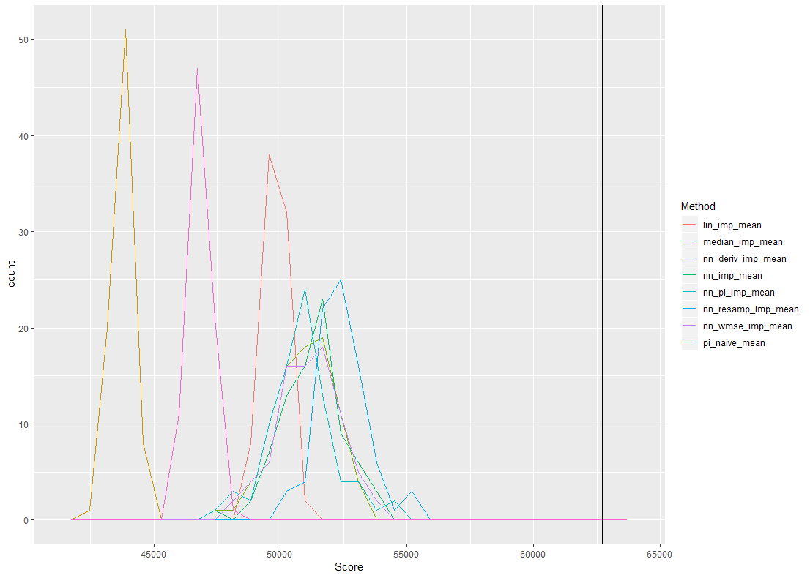

# Consumer Expenditure Surveys

## Data
The Consumer Expenditure (CE) Surveys ^[https://www.bls.gov/cex/pumd-getting-started-guide.htm] provide data on "expenditures, income, and demographic characteristics of consumers in the United States. The CE data are collected by the Census Bureau for the Bureau of Labor Statistics (BLS). The data are primary used to revise the relative importance of goods and services in the market basket of the Consumer Price Index". 

The data will be the `fmli171x` survey data, one of the quarterly surveys for 2017 which contains household information such as specific incomes, expenditures, home description, and family description. The data has a low degree of missingness as quarterly information is propagated between surveys to create complete observations.

The mean estimation methods from chapter 3 will be used to estimate the population mean household income before tax, `FINCBTAX`. The features used to predict this label are:
- `pi`, the inclusion probability (1 / `FINLWT21`, the survey weight provided by BLS)
- `AGE_REF`, the age of the reference person (the person who answered the survey)
- `BATHRMQ`, the number of bathrooms in the home
- `BEDROOMQ`, the number of bedrooms in the home
- `EDUC_REF`, the education of the reference person (some highschool, etc)
- `FAM_SIZE`, the number of family members in the home
- `TOTEXPCQ`, the total household expenditures last quarter

Like all data gathered by BLS `FINCBTAX` and some features are subject to missingness, but have been in the data sets. This means for the purpose of the experiment on method imputation quality, we must artifically impose missingness then compare the imputation results to a combination of true labels and BLS-derived labels. This is an unavoidable pitfall of working with real data, as we paradoxically require "truly missing" labels to impute, but need the true label to compare the quality of the imputation to.

According IRS Statistics of Income, the average household adjusted gross income (AGI) was \$67,565 in 2015. This is the last year the population mean household income is available. This numbercould be considered the true population mean $\mu_y$, but is derived differently than the BLS CE data and is slightly different than the Horvitz-Thompson estimator for the sample on `FINCBTAX`.

## Procedure
The CE data method performance comparison will be performed in much the same way as the simulated data method comparison.

The `fmli171x` survey data is first pre-processed to remove features with large swathes of missingness. For this study, features with more than 33% missing values are dropped from the data set. Features with missingness less than 33% are then median-imputed, where missing values are replaced with the median value of the feature. The median in this case is used for reasons: it returns only reasonable values, is uninformative, and does not rely on multiple imputation.

The label to be used is `FINCBTAX`, the financial income of the response household before taxes. This label has no missingness as it is BLS-derived (already imputed).

This process returns a complete-case data set of 6208 family samples across 607 variables. There are 127 million households in the US, whcih can be used as an approximate population size $N$.

The problem of assessing model performance in real-world data is the paradox of missing labels: ideally, we would impute a missing label, then learn the true value, and score the model accordingly. For this data, we will again rely on Monte Carlo simulation to create a distribution of population mean estimates (U.S. mean household income) by inducing missingness in the known labels, imputing, and comparing results via MSE to the true mean.

The following process is repeated a number of times to create a distribution of mean estimates for each method:

1. Record the true (sample) mean and Horvitz-Thompson mean estimate
2. Induce missingness on 20% of the labels, weighted to larger labels
3. Perform and record each model's mean estimate. For this experiment, a more accurate neural network training method is adopted in which each network undergoes two trainings: the first finds the ideal train duration by overtraining on the training data, the second re-trains the model to the validation minimum of the first model. This is the correct training method which was eschewed from Chapter 4 due to the computational intensity of double-training. 
4. The results are compared using mean squared error to $'mu_y$, oracle ratio, and percent relative bias. 

The dimension of the neural networks has changed somewhat to account for the new data. Since the number of informative parameters has increased along with the complexity of the generative function transforming them to the label, the size of the model has increased. The standard real-data neural network uses the same two hidden layers activated by `relu` and a linear output layer, but now has 64 hidden units per layer. This describes a significantly higher dimension model as the input vector $\boldsymbol{x}$ undergoes multiple high dimension linear transformations wrapped in the `relu` activation:
$$
\boldsymbol{x} \in \mathbb{R}^6 \\
\rightarrow \mathbb{R}^{64} \\
\rightarrow \mathbb{R}^{64} \rightarrow \mathbb{R}
$$
Parameterized by matrices of dimension $6 \times 64$, $64 \times 64$, $64 \times 1$, instead of $6 \times 32$, $32 \times 32$, $32 \times 1$ as in the 32 hidden unit simulation.

To accomidate the significantly higher number of trainable features in this network the hyperparameter $\omega$, the learning rate, must be initialized higher in the `adam` optimization algorithm. This can expedite the number of epochs (training data exposures) needed for the algorithm to converge, but can sacrifice predictive fidelty, a constraint imposed by computational demand. This tradeoff is made in the name of a more statistically informative monte carlo simulation.

## Results

```{r ce_results_hist, echo = FALSE, out.width="80%"}

```

```{r CE_results, echo = FALSE, out.width="80%"}
knitr::include_graphics("figure/clean_results_histogram")
```

