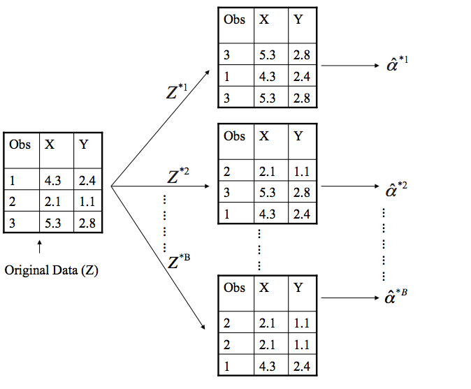

<!--
Above is the YAML (YAML Ain't Markup Language) header that includes a lot of metadata used to produce the document.  Be careful with spacing in this header!

If you'd prefer to not include a Dedication, for example, simply delete lines 17 and 18 above or add a # before them to comment them out.  If you have other LaTeX packages you would like to include, delete the # before header-includes and list the packages after hyphens on new lines.

If you'd like to include a comment that won't be produced in your resulting file enclose it in a block like this.
-->

<!--
If you receive a duplicate label error after knitting, make sure to delete the index.Rmd file and then knit again.
-->


<!-- You'll need to include the order that you'd like Rmd files to appear in the _bookdown.yml file for
PDF files and also delete the # before rmd_files: there.  You'll want to not include 00(two-hyphens)prelim.Rmd
and 00-abstract.Rmd since they are handled in the YAML above differently for the PDF version.
-->

<!-- The {.unnumbered} option here means that the introduction will be "Chapter 0." You can also use {-} for no numbers
on chapters.
-->

# Introduction {.unnumbered}

Welcome to the _R Markdown_ thesis template. This template is based on (and in many places copied directly from) the Reed College LaTeX template, but hopefully it will provide a nicer interface for those that have never used TeX or LaTeX before.  Using _R Markdown_ will also allow you to easily keep track of your analyses in **R** chunks of code, with the resulting plots and output included as well.  The hope is this _R Markdown_ template gets you in the habit of doing reproducible research, which benefits you long-term as a researcher, but also will greatly help anyone that is trying to reproduce or build onto your results down the road.

Hopefully, you won't have much of a learning period to go through and you will reap the benefits of a nicely formatted thesis.  The use of LaTeX in combination with _Markdown_ is more consistent than the output of a word processor, much less prone to corruption or crashing, and the resulting file is smaller than a Word file. While you may have never had problems using Word in the past, your thesis is likely going to be about twice as large and complex as anything you've written before, taxing Word's capabilities.  After working with _Markdown_ and **R** together for a few weeks, we are confident this will be your reporting style of choice going forward.

<!-- 
If you're still on the fence about using _R Markdown_, check out the resource for newbies available at <https://ismayc.github.io/rbasics-book/> or email us at <data@reed.edu>. 
-->

**Why use it?**

_R Markdown_ creates a simple and straightforward way to interface with the beauty of LaTeX.  Packages have been written in **R** to work directly with LaTeX to produce nicely formatting tables and paragraphs. In addition to creating a user friendly interface to LaTeX, _R Markdown_ also allows you to read in your data, to analyze it and to visualize it using **R** functions, and also to provide the documentation and commentary on the results of your project.  Further, it allows for **R** results to be passed inline to the commentary of your results.  You'll see more on this later.  

<!-- 
Having your code and commentary all together in one place has a plethora of benefits!
-->

**Who should use it?**

Anyone who needs to use data analysis, math, tables, a lot of figures, complex cross-references, or who just cares about the final appearance of their document should use _R Markdown_. Of particular use should be anyone in the sciences, but the user-friendly nature of _Markdown_ and its ability to keep track of and easily include figures, automatically generate a table of contents, index, references, table of figures, etc. should make it of great benefit to nearly anyone writing a thesis project.

<!--chapter:end:index.Rmd-->

<!--
This is for including Chapter 1.  Notice that it's also good practice to name your chunk.  This will help you debug potential issues as you knit.  The chunk above is called intro and the one below is called chapter1.  Feel free to change the name of the Rmd file as you wish, but don't forget to change it here from chap1.Rmd.
-->

<!--
The {#rmd-basics} text after the chapter declaration will allow us to link throughout the document back to the beginning of Chapter 1.  These labels will automatically be generated (if not specified) by changing the spaces to hyphens and capital letters to lowercase.  Look for the reference to this label at the beginning of Chapter 2.
-->

# Complex Surveys

## Survey Statistics

> Researchers in the social science and health sciences are increasingly interested in using data from complex surveys to conduct the same sorts of analyses that they traditionally conduct with more straightforward data. - Lumley 1969

The implicit pervasiveness of survey statistics in all data motivates our exploration into its significance in imputation.

Survey statistics differ from statistics modelling in the specification of the random process that generates the data. In model-based statistics, some underlying generative model from which observations are drawn is assumed to exist. By understanding or approximating this model from data, one may draw conclusions on the nature of the generative function provided no meaningful changes to the data are made.

Contrary to model-based statistics, the analysis of complex survey samples are design based. The observations from a researcher-specified population have fixed features, and randomness is introduced when these observations are drawn from the population according to some stochastic design. This random process is under the control of the researcher, and can be known precisely. The significance of design-based methods is that the probability sample design is the procedure for taking samples from a population, not just the resulting data. This is a significant departure from the statistical analysis mindset that randomness is an element of the features and labels of a population. Using this method, the features of the population from which the observations are drawn may be estimated, but these conclusions may not generalize to other populations. With understanding of the survey sampling design from which data observations arise, the researcher may make improved estimates of the population of study compared to naive estimates [@lumley2011complex]. 

The probability sample design is the fundamental concept of design-based inference. Taking a random sample of 36,000 people from Oregon is an example of a survey design which implies independent and equal probability sampling of all humans in the state. The Law of Large Numbers is invoked to assume the distribution of sampled observations represents the population from which they are drawn according to any features of interest to the researcher, such as height, weight, or age.

This type of surveying can be complicated by adding unequal inclusion probability to the features to oversample from minority groups. The data created by such a design would likely not be representative of the population, since people with higher inclusion probabilities would be more likely to be sampled. However, since the probability of each person in the sample being randomly selected is known (since the population total is known), this is still a probability sample. The key point of this process is that a probability sample is the procedure for taking samples from a population, not a data set [@lumley2011complex].

There are four requirements for a data set to be a probability sample:

1. Every individual in the population must have a non-zero probability of ending up in the sample.

2. The probability of inclusion must be known for every individual who does end up in the sample.

3. Every pair of individuals in the sample must have a non-zero probability of both ending up in the sample.

4. The probability of every pair of individuals being included in the sample must be known for every pair of individuals in the sample.

1 and 2 are necessary in order to get valid population estimates, 3 and 4 are necessary to work out the accuracy of the estimates. If individuals were sampled independently of each other the first two properties would guarantee the last two [@lumley2011complex]. Though 3 and 4 are requirements of a probability sample, they are often not included in datasets as they require an $n \times n$ matrix of probabilities, where $n$ is the number of observations in the data set.

The fundamental statistical idea behind all of design-based inference is that an individual sampled with a sampling probability $\pi_i$ represents $\frac{1}{\pi_i}$ individuals in the population. The value $\frac{1}{\pi_i}$ is called the sampling weight [@lumley2011complex]. Since observations represent different proportions of the population, the inclusion probability must be accounted for in modeling and estimation procedures.

Data collected under a complex survey design have an additional layer of complexity and are not to be treated as independent and identically distributed (*i.i.d.*). Ignoring this complex survey design is found to create significant error in data analyses [@toth2011building]. This concern motivates our exploration of accounting for survey design in neural network imputation.

## Imputation

Often in real-world data, there is some degree of missingness. This can be for any number of reasons, illustrated below:


```

Attaching package: 'kableExtra'
```

```
The following object is masked from 'package:dplyr':

    group_rows
```

\begin{table}[t]

\caption{(\#tab:missingness)Types of missingess}
\centering
\begin{tabular}{l|l}
\hline
  & Description\\
\hline
Noncoverage & An element in the target population is not included in the survey sampling frame\\
\hline
Total Nonresponse & A sampled element does not participate in the survey\\
\hline
Item Nonresponse & A responding sampled element fails to provide acceptable responses to one or more of the survey items\\
\hline
\end{tabular}
\end{table}
Item nonresponse is the focus of this thesis. Item nonresponse will be restricted to a response value of interest called a label and will be present in some of the observations. The other variables of the observation, called features, will be fully present. The usual form of handling item nonresponse is imputation, which fills in missing values with usable information [@brick1996handling]. Common algorithms such as Principal Component Analysis and regression require no missingness in the data set, so replacing NA values with useable information is vital for analysis.

In many statistical analyses, observations with any degree of missingness cannot be included. For example, how would one perform a linear regression with observations that have features but no label? Dropping these terms would remove potentially huge swathes of the data set, particularly in multivariate data sets, and would potentially create systematic bias. 

Suppose for example a data set with information on roses had a feature with stem length and a label on flower size measured by a researcher. There might be missing values for flower size that are not randomly distributed: Before the researcher makes measurements, there has been systematic removal of the large-flowered roses by passersby. To ignore these observations would lead the analyst to draw false conclusions on the relationship of stem length to flower size, the distribution of flower sizes in the population, and estimations of the mean flower size in the population of all flowers, visualized in Example 1.1:


<!-- --> 

Imputation attempts to address this common dilemma in real-world data. Imputation is the process of replacing missingness in data sets with some value that redeems the observation for some degree of analysis. "The aim of these methods is to compensate for the missing data in such a manner that the analysis file may be subjected to any form of analysis without the need for further consideration of the missing data" [@brick1996handling]. Imputation assigns values to missing responses, which allows records with missingness to be retained during analysis. Ideally, imputation would eliminate bias in survey estimates caused by ignoring records with missing data. The catch is that imputation can destroy intervariable relationships, as well as overestimate the precision of survey estimates on fabricated data.

There are stochastic and deterministic methods for imputation. Deterministic regression imputation is the predicted value from a regression trained on complete-case data. Stochastic imputation differs due to an additional residual added term to the predicted value, taken either from a random respondent or comparable observation, and is usually preferred due to the importance of shape parameters in many analyses [@brick1996handling].

One traditional method of imputation is the "Hot-Deck Method", which was generally favorable when computation was less efficient. Hot Deck Imputation  requires extensive knowledge of the survey variables in order to optimize performance since explicit model-based imputation needs a valid model for every survey variable [@maiti2008neural]. This thesis proposes naive artificial neural networks as a solution which requires minimal domain knowledge and resists the curse of dimensionality which other nonparametric methods are susceptible to, such as local polynomial regression [@maiti2008neural].

Due to the difficulties imposed by working with high-dimensional, complex survey data with varying degrees of domain knowledge, we turn to neural networks and their structural benefits to reliably perform these challenging imputation problems.

<!--chapter:end:01-chap1.Rmd-->

# Neural Networks {#math-sci}

<!-- Required to number equations in HTML files -->
<script type="text/x-mathjax-config">
MathJax.Hub.Config({
  TeX: { equationNumbers: { autoNumber: "AMS" } }
});
</script>

## Introduction to Machine Learning

> From the advent of computation, there has been a drive towards automation. [@goodfellow2016deep]

The capacity to derive patterns from raw data is known as machine learning, a broad term for an extremely diverse collection of algorithms. Machine learning flips the script on classical programming: whereas classical programming takes rules and data to produce answers, machine learning creates rules from data and answers by being "trained rather than explicitly programmed. It's presented with many examples relevant to a task, and it finds a structure that derives rules for automating the task" [@chollet2018deep].

Machine learning is intended to elucidate or predict patterns in data. These algorithms handle anything from linear regression for predicting a numerical response based on a number of features, to clustering for visualization and assignment of untaught observation classes. Machine learning models are trained by minimizing error during exposure to labelled "training" data with some underlying distribution and random noise. After training, models are passed unlabelled "test" data to predict the corresponding unknown class or value. Predictive (supervised) machine learning algorithms seek to emulate and elucidate a true unknown generative function from which the data were drawn.

For imputation purposes, our goal will be to accurately estimate missing values by approximating the generative function from which they are drawn. Generative functions are of the form
$$
y = f(x_1, x_2, \dots, x_n) + \epsilon
$$
where the true label $y$ of the observation is a function of the features $x_1, ..., x_n$ perturbed by some random noise $\epsilon$.

The estimating model will be trained via exposure to labelled observations, called the training data, then used to predict observations with missing labels, called testing data. The challenge in machine learning is learning the correct amount from training data in order to derive the underlying distribution of the observations without simply memorizing the labels of the training set. This memorizaion problem is called overfitting and is central to machine learning.

\@ref(fig:overfit) is an illustration of this pervasive principle in a regression example. An overfit (or too-flexible) model simply learns the observation's labels, rather than the underlying distribution (or generative function, in this case a second-degree polynomial). The overfit model fails to learn the underlying generative function, and instead learns the random noise of the training observations, and thus is a poor explanation of a new realization from the same generative function, seen in \@ref(fig:overfit) and \@ref(fig:overfitre):

 

 

An underfit model, \@ref(fig:underfit), also fails to capture the underlying distribution, due to a lack of flexibility. A linear regression, though it minimizes its training MSE, clearly fails to capture the underlying distribution of the data:

 

\@ref(fig:goodmod) displays a well-trained model which straddles these extrema and captures the apparent underlying distribution of the data in a general sense by approximating the generative function from which they are drawn, and remains fairly constant under different draws from the same distribution. The aptly-flexible model has consistent performance on new realizations of the data. The model performing well on data it was not trained on is called generalizability.


 
Fortmann, Scott. “Bias and Variance.” Understanding the Bias-Variance Tradeoff, June 2012, scott.fortmann-roe.com/docs/BiasVariance.html.

Figure \@ref(fig:biasvar) demonstrates the involvement of model complexity (or flexibility) in terms of training error. Model complexity refers to the ability of the model to approximate complex generative functions. We see that as the flexibility of the model increases, the bias on the training set always decreases, representing the model's performance on observations with labels. However, complexity beyond the models optimal value implies over-flexibility, in which the model is able to memorize random noise rather than stopping at the trend of the data. This increases the total error of the model when exposed to data that comes from the same generative function that the model has not been exposed to, such as a testing data set or another observation from outside the training set. Higher flexibility models create more variable models, which though trained on data from the same generative function differ greatly in appearance due to the random sample of training data. These models are unstable for inference and generalize poorly. 

One key difference from statistical modelling and survey statistics methods is the point at which randomness is introduced into the data. Machine learning attempts to approximate the function from which the data was randomly generated, while survey statistics imply that randomness in data comes from the survey design. The paradox of where randomness is introduced into the data is resolved with the existence of a superpopulation $U$, where each observation has label $y = f(x) + \epsilon$, some generative function. From this superpopulation, a population $u$ is created through *i.i.d.* realizations from $U$. From this population $u$, the survey is taken. Thus there still exists a generative function from which the population is drawn, but the features and label of the observations are fixed by the time the complex survey is taken on the population, reconciling the two methodologies.

## Neural Networks
### Background and Context
Neural networks are a family of machine learning algorithms with an extended and diverse history of research in neuroscience, statistics, and computer science. Recently, these models have experienced great growth in attention and popularity due to the contemporary circumstance of computational capability. Neural networks thrive on large training data sets, which have tended to increase in size and availability throughout time. Neural networks also outperform competing algorithms in high-dimension feature problems, which are common in real-world machine learning applications such as image data, waveform data, and large surveys. Often utilizing derivatives of complex compositions of functions as an optimization method, deep learning training periods are computationally intensive, relying heavily on computer hardware and optimized software for reasonable implementation. Lastly, recent attention to and development of neural networks can be attributed to their proven potential in solving complicated real-world applications with promising and increasingly dominant accuracy in practice, often at the cost of a lack of inferability.

This lack of inferability is the typical downside of working with neural networks as the inference on a model can be more important than the predictive accuracy depending on the problem. Once a simple linear regression is trained, the coefficients on the predictors offer an immediately understandable interpretation of the behavior of the data. For example, a coefficient of .3 on a feature $x$ has a simple, instant understanding: as feature $x$ goes up by 1, the response goes up by .3. Neural networks however, lack this instant recognition due to the less intuitive layered structure of input transformations, known as representation learning.

### Basics
Neural Networks are a composition of functions. The following describes a full neural network:

$$
\hat y = f(\boldsymbol{x}; \theta, \omega) = f^n ( f^{n-1}  ( ... f^1(\boldsymbol{x}; \theta, \omega)))
$$
In this function, we see the input features $x \in \mathbb{R}^n$, the learned coefficients $\theta$, the learning rate $\omega \in \mathbb{R}$, and the output prediction $\hat{y}$.
Consider one of the layers of the network, $f^i$. This layer is an activation function composed with a linear function:

$$
f^i = \max ( 0 , {\boldsymbol{W}_i}^T \boldsymbol{x} + c_i)
$$
Where $\boldsymbol{W}_i^T \boldsymbol{x} + c_i$ is the interior linear function for $\boldsymbol{W}_i^T \in \mathbb{R}^n$, $c_i \in \mathbb{R}$.

The activation function shown above is the rectified linear unit, or $\max(0,a)$. Activation functions are significant as they introduce nonlinearity into what would otherwise be a linear function (a composition of linear functions).
${W_i}^T$ and $c$ in $f_i$ dictate a linear transformation on the input to the layer. An ordered list of all elements of $W_i$ and $c_i$ for all $i \in n$ would give the full description of the network, called $\theta$. So the output of a  1-layer network can be expressed as

$$
f(x; W, c, w, b) = w^T \max( 0 , \boldsymbol{W}^T \boldsymbol{x} +c ) +b
$$

The final activation function is another structural parameter left to the designer of the network, but differs from interior activation functions as the output of the network is restricted to the codomain of the function, limiting the number of reasonable choices. The typical output layer for scalar regression is a linear unit, on behalf of the codomain $(-\infty,\infty)$ of the activation:
$$
f^n(\boldsymbol{x}) = 1*(\boldsymbol{W}_n^T \boldsymbol{x} + c_n)
$$

The learning rate $\omega$ and a loss function are meta-parameters, given by the user creating the neural network. These two parameters are used during the training of the network. During training, gradient descent is used to descend the loss function in order to find the optimal parameters for the network.

Loss functions are ways of describing the performance of a model when predicting labels of a data set. The loss function takes the model and data as inputs, and outputs a real number. Loss functions can be minimized in training by optimization which leads the network to find improvements in weights yielding accurate predictions. Loss functions allow for another degree of customization in the training of a network, such as in Ridge and LASSO regression. These algorithms add a weighting to the typical mean squared error loss function which penalizes the weights on predictors in polynomial regression. These methods introduce bias into otherwise unbiased algorithms, but reduce the variability of the model across different draws of data from the same distribution, aiming to reduce the real test loss and improve the model. The cross entropy between the data distribution and the model distribution is the typical choice [@goodfellow2016deep].

Cross Entropy:
$$
\int_\chi P(x) \log Q (x) dr(x) = E_p [- \log Q]
$$

Take for example the Mean Squared Error cost function:
$$
MSE = \frac{1}{n} \sum_{k=1}^n  (y - \hat y)
$$

MSE, a typical loss function for regression applications, takes the mean squared difference of the predicted label $\hat y$ and the true label $y$ of the observations.

\begin{figure}
\includegraphics[width=0.7\linewidth]{figure/optimize} \caption{A convex loss function}(\#fig:optimize)
\end{figure}

https://medium.com/@ageitgey/machine-learning-is-fun-80ea3ec3c471

CITE ME

We can see that the loss of a linear regression is a function of $m$ and $c$ given some data which is minimized at $m = 0$ and $c = 0$. The learning rate is the amount that the functions' coefficients are updated as the loss function is optimized from some initial coordinates in search of the minimum loss.

Much like training a linear regression, the training of the neural network aims to drive the approximating function to the underlying function. The important difference induced by nonparametric models, however, is the nonconvexity of the loss. The large amount of coefficients which define even a relatively small network complicate the optimization problem and make local minima a demanding distraction. Optimization is typically done with gradient learning using a loss function, or maximum likelihood estimation. Most modern neural networks are trained using maximum likelihood, in  which the cost function is the negative log-likelihood between the training data and model distribution [@goodfellow2016deep].

### Representation Learning

[[kelly, tell me if i should just delete this cheesy paragraph:]]
If you were handed a photograph and were asked if it contained a car, there's a good chance you would immediately know the answer. But how are you coming to this conclusion? The human mind recognizes patterns of the image it has seen before, like a round bumper, a rectangular windshield, and a few circular tires with a certain spatial relationship to come to the conclusion that there is, in fact, a car in the photograph. It is this process of representation learning that prompted early researchers [[Citation Needed]] to create representation-based learning algorithms to extrapolate on information in the same way as the human mind. The emulation of human neural cells was the birth of deep learning, a class of machine learning algorithms which takes its name from multiple layers of connected nodes simulating a proposed structure of the neurons of the human mind. Representation learning takes observation's features as a first layer into a composition of functions, in which each layer (or function) transforms the data according to a learned representation transformation that the subsequent layer takes as an input. This composition allows for complex relationships of features to be learned in increasingly sophisticated ways, making neural networks ideal for large-dimensional datasets. For large-dimensional features, such as in Consumer Spending Data, images, or audio, these hierarchical representations (or layered representations) are important for distilling human-like feature extraction and iterative predictor space transformation. To achieve hierarchical representation properties, subsequent layers understand more complex functions of input variables as each layer transforms inputs and optimizes weights and weight relationships that minimize the overall loss of the network. As each layer receives the transformed output of the previous layer, more complex relationships of features can be derived.

Successive layers of the network learn representation transformations of the data which lend themselves to increasingly accurate description by linear regression and activation performed by the final layer, called the output layer. This process of successive transformation learns meaningful representations on which the output layer can be most accurate. Since the full network does not have a single functional representation, it is nonparametric. The flexibility and power of neural networks in fields demanding domain knowledge is that they can approximate any function, per the Universal Approximation Theorem (Hornik et al., 1989; Cybenko, 1989). The theorem states that a feedforward network with a linear output layer and at least one hidden layer with any "squashing" activation function can approximate any Borel measurable function from one finite-dimensional space to another with any desired nonzero amount of error, provided that the network is given enough hidden units. Thus the user decision required is the depth and breadth of the network, optimized through validation set meta-analysis.

Representation learning is extremely important to the broad promises of neural networks in practice. The basis for this strength is that subsequent layers of the network learn meaningful structures of the input data associated with a lower loss score. Correlations of features forming a functional relationship to the label which induce loss function descent will be internalized by the composition of subsequent functions. This property of representation learning is significant for investigating the necessity of independent and identically distributed data in deep learning algorithms. It could be the case that the significance of the inclusion probability can be learned as a meaningful feature, with no special tweaks or preprocessing necessary for the algorithm. Data which require no special tweeks are extremely meaningful as this circumvents the necessity of incorporating domain knowledge and expertise in current imputation methods, which holds back expedient and lightweight research.

These advantages of Hierarchical and Distributed Representation transformation give neural networks huge advantages in accuracy and fitting capability for data with a massive hypothesis space. A hypothesis space is the space of all possible answers to a question. Image classification, for instance, represents a hypothesis space of pixels with unknown correlations that must be trained with label relationships to determine the correct distillation of millions of pixels to a most-likely class label. Thus the curse of dimensionality common throughout machine learning is mitigated through this manifold learning process.

Neural networks thrive on the interaction of many features, due to the nature of representation learning which excels in covariate relations and distilling information encoded between features. Popular modern applications are image and waveform audio data, in which machine learning problems become dominated by the Curse of Dimensionality. This common machine learning problem arises when the amount of data is insignificant when compared to the hypothesis space or feature space, and there are sparse observations for some regions. Machine learning needs many observations with each combination of values, but this becomes quickly infeasible for data with thousands of features. The peaking phenomena dictates that there is an optimal number of features to describe the data before the curse of dimensionality creates problematic sparsity and dominating observations with few neighbors . Neural networks are known to resist this commonplace issue due to the distributed learning property, wherein each node is sensitive to only particular features.

Distributed representation is a powerful implicit component of neural networks in which neurons divide feature space to better handle feature interactions: suppose an image-recognition system could recognize cars, trucks, and birds, as well as distinguish if these objects are red, green, or blue. One way of representing these inputs could be to have a separate neuron for each combination: red truck, red car, red bird, and so on for nine independent neurons. Distributed representation, however, could partition these workloads by having three neurons for color and three for object type. In addition to reducing the number of neurons required dimensionally, this also distributes the learning demands of each neuron. The neuron describing redness is able to learn about redness from any category, not one specific category as the red bird neuron must [@goodfellow2016deep].

Neural networks approximate nonlinear functions by applying linear models not to the features x, but to a transformed input, $\phi(x)$, where $\phi$ is a nonlinear transformation. $\phi$ provides a new, more meaningful representation for $x$. The question then is how to choose the mapping $\phi$:

1. One option is to manually engineer $\phi$. This takes a huge speciality of domain knowledge and practitioner specialization, with little transfer between domains. This was the dominant method before deep learning [@goodfellow2016deep].

2. The strategy of neural networks comes from the learning of $\phi$. "In this approach, we have a  model y = f(x; theta, w) as specified in the neural network introduction. Due to the Universal Approximation Theorem, the nonparametric deep feedforward network can learn a functional approximation from the input to the desired output. This method sacrifices the training convexity of the other two, but benefits from the genericity of the specifications. The human user need only specify a general function family rather than exactly the correct function, but can still benefit from designing families of $\phi(x; \theta)$ that they expect to be relevant [@goodfellow2016deep].

The neural network approximates some true underlying function $f^*(p; \theta)$ of the predictors $x$ to the output category, $y$, and learns the coefficients $\theta$ of the series of linear transformations composing the layers that result in the best function approximation. The number of functions in the composition is the called the depth of the model. Our model is called $\hat f$, the generative function it seeks to approximate is called $f$. The outputs of our model are $\hat y$ "guess at y" and the true labels are $y$.

### Neural Networks for Complex Survey Data

From an optimist's perspective, the need for data preprocessing or special conditions on the loss function for training the model would be unnecessary: If learning the correlations and underlying distributions associated with rare observations from complex survey design would truly lower the network's loss, it should be learned and accounted for without the need to perform special external transformations on the data to "undo" the effects of complex sample design. For this reason, it is significant to compare the potentially superior results of a naive model to one with superfluous data transformations done. A neural network model with access to an informative $\pi$ feature ideally would approximate the function relating the inclusion probability and features to labels, without the need for extreme domain knowledge and manual feature engineering.

The optimism of nonparametric algorithms increases in tasks of minimal domain knowledge and feature engineering capability. Ideally, using heuristic meta-parameters defining a neural network model would be enough to get reasonable predictive accuracy in conjunction with one of the methods of Chapter 3. Per the Universal Approximation Theorem, any underlying generative function is at worst approximated by a 2 layer heuristic model, potentially improving upon other naive modeling procedures such as a weighted linear regression. Additionally, in real survey data the capacity to derive the significant features from a high-dimensional space is a weakness of parametric model regression, which is highly variable in the context of noisy parameters, explored in Chapter 4.


<!--chapter:end:02-chap2.Rmd-->

# Methods
Missingness is an extremely common problem in real data sets. Many analyses and algorithms such as regression, classification, PCA, and clustering done throughout the sciences rely on having entirely complete observations. For this reason, some strategy must be adopted to transform a raw data set into an analyzable one.

There are multiple approaches for a researcher interested in going about this process. The researcher has a data set gathered under a complex survey design where the features $x_1,...x_n$ and inclusion probability $\pi_i$ is known for all $i$, though the label $y_i$ may be missing due to item nonresponse. In order to create a data set with no missing values, the researcher may choose to adopt one of the following methods. These methods borrow notions from complex survey design about using design variables to model how characteristics of the population affecting the sample [@maiti2008neural]. Neural network methods have the advantage of flexibility in approximating any functional relationship, and can be tuned using sampling weights to account for complex sampling design using unequal sampling [@maiti2008neural].

There are two primary tasks for a researcher: representative complete-case data, and statistic estimation via accurate imputation. The following methods are imputation techniques designed with these goals in mind. Imputation methods utilize different techniques to create a complete-case dataset by estimating missing values based on information from the complete cases. Once the missing values are imputed, the population statistic is estimated and the approximate complete-case data set may be used.

## Mean Estimation Methods
A common statistic of interest to a researcher is an estimate of the population mean $\mu_y$ using the information from the complex sample with missingness, but taking the naive mean of complete cases is insufficient for two reasons. The first has been discussed in Chapter 1, which is the potential of systematic missingness in the data. The second is that the naive mean makes the assumption that the observations represent equal proportions of the population, as in an *i.i.d.* sample.

### Naive Mean:
$$
\hat \mu_y = \frac{1}{r} \sum_{i=1}^r y_i
$$
Where $r$ are the complete-case respondents.

We resolve this issue in the mean estimate formula by weighting contributions to the mean by $\frac{1}{\pi_i}$, the approximate number of population members represented by observation $i$:

### Pi-Corrected Naive Mean:
$$
\hat \mu_y = \frac{1}{\hat N} \sum_{i=1}^r y_i \frac{1}{\pi_i}
$$
Where $\hat N = \sum_{i=1}^r \frac{1}{\pi_i}$. This resolves the problem of ignoring the survey design in estimation, but does not account for systematic bias resulting from missingness. This will be an under-estimate of the true population mean in the presence of systematic missingess of large observations.

Let $\hat \mu_y$ be the sample estimate of the population mean $\mu_y$. The oracle mean can be considered the "best estimate" of $\mu_y$, but it is only available in simulation. The oracle mean uses information that the simulation manually drops so as to create an ideal population estimate given a survey sample:

### Oracle Mean:
$$
\hat \mu_{\text{oracle}} = \frac{1}{n} \sum_{i=1}^n y_i \frac{1}{\pi_i}
$$
This is the Horvitz-Thompson estimator with access to the complete sample before missingness is induced. The oracle mean will be used as a benchmark against which the other methods will be compared.

## Imputation Methods
In order to combat the presence of systematic missing values, we utilize imputation to label the missing observations with the best estimate of $y_i$, $\hat y_i$. Imputation has the added benefit of approximating a complete-case dataset without dropping observations.

### Imputation Mean Estimator:
$$
\hat \mu_y(\text{method}) = \frac{1}{\hat N} (\sum_{i=1}^{r} \frac{y_i}{\pi_i} + \sum_{i=1}^{y-r} \frac{\hat y_i}{\pi_i})
$$
Where $y-r$ are the missing cases, $r$ are the respondents, and $\hat N = \sum_{i=1}^n \frac{1}{\pi_i}$.

### Drop.NA
One option is to simply remove the observations with missing labels from the data set. This method is extremely easy to implement and serves as a sure-fire way to end up with a data set with no missing values. There are two downsides to this method: The first is that removing observations with missingness obviously decreases the size of the data set and can nontrivially reduce the fidelity of models aiming to understand the population from which the data was taken. The second problem is the assumption of random missingness. If there is any correlation of label to amount of missingness, systematic bias is introduced into the data set, as discussed in Chapter 1. For example, if there is a possibility that larger values are more likely to be dropped, then as a result the sample mean would underestimate the population mean.

### Median Imputation
Median imputation is another easy way to get complete cases in data for analysis or estimation. Median imputation simply fills in the missing labels with the median of the respondent labels. Median imputation has multiple problems for analysis or estimation. The median offers equal weighting to all observations in a data set, meaning it destroys the informativity of the inclusion probability $\pi$. It also removes correlation of feature and label, making analyses such as PCA less informative, as covariate relations dictate axis derivations. Median imputation is extremely fast to execute and implement, but creates noninformative observations in the same manner as the Drop.NA method.

### Weighted Linear Regression Imputation
Linear regression is a convex optimization problem of $n+1$ parameters, where $\hat f(x) = \hat y = (m_1x_1 + .+ m_nx_n)+b$ is the estimate of $y$ for observation $i$. Using the mean of the squared difference between the predicted and actual responses of a training data set, weighted-MSE linear regression scales the squared error contribution of each observation by $\frac{1}{\pi_i}$ to account for rare-case observations with potentially systematic missingess:
$$
\text{MSE}(f) = \frac{1}{r} \sum_{i=1}^r  (\frac{1}{\pi}(\hat{y} - y))^2
$$
Significant to this algorithm, however, is the contribution of $\pi$ regardless of whether it is informative. In data known to have systematic label missingness, this is not a problem. However, it is not always the case that $\pi$ is informative, and including this scaling term would be harmful to cases in which $\pi$ and $y$ are uncorrelated.

### Naive Neural Network Imputation
Neural Network Imputation is our baseline model for imputation for estimating a population mean. The number of hidden layers, nodes, and loss is left to the user, which would be an incorporation of domain knowledge or exploratory modelling to derive a reasonable model load for learning the data's generative function. In the context of the researcher having minimal knowledge of the data, a neural network with 2 hidden layers of 32 units activated by `relu` functions is a reasonable starting point. Overtraining due to overflexible models can be stimied with a validation set, assuming the data is not so small as to create unrepresentative data by subsetting the training data further ($n > 10^3$). "Naive" neural network imputation refers to this model not having access to the $\pi$ feature of the observations as a predictor or incorporate it in any way. This model uses the assumption that the data is *i.i.d* as a representative for ignoring the survey design, an assumption which is known to be a significant problem. Regardless, the neural network should approximate the generative function with some nonparametric fit, but underestimate the population mean as a result of systematic missingness and observation equity. This baseline model will be the pacemaker for the other neural network methods to improve upon by incorporating survey design information.

### Weighted Loss Neural Network Imputation
Weighted Loss Neural Network Imputation takes inspiration from the weighted linear regression algorithm. This neural network training uses the same $\pi$-weighted MSE, but sacrifices the convexity of the loss function, which means pervasive local minima which are distracting to the learning algorithm. The existence of local minima from the high-dimensional model space comes from the flexibility of the many hidden neurons weight transformations within the model. A loss-weighted neural network hopes to account for systematic missingness in the data by heavily punishing the loss term generated from rarer observations. Since rare observations are more likely to be missing, they must be given more weight since they appear less in the training data then the population. Thus a weighting scheme attempts to un-do systematic missingness by making the rarer observations as "heavy" as they would be in the true population by making outliers be worth multiple observations to the loss contribution.

### $\pi$-Feature Neural Network Imputation
A $\pi$-feature neural network has access to $\pi$ as a predictor during training and testing. This is a realistic assumption to make as data collected under a complex survey design must have a $\pi$ probability regardless of whether the label is missing. This method has the benefit of adapting to whether $\pi$ is truly correlated to $y$, which the loss-weighted method assumes. A neural network optimist could claim that if there is a significant relationship of $\pi$ to $y$, it will be reflected in the loss during training and the network will adapt accordingly to the information provided by the feature. However if $\pi$ and $y$ are uncorrelated and the missingess is random, the network will not still weight the observations and will correctly ignore the feature to create more accurate predictions with no need for domain knowledge on the relationship of the missingness.

<!-- --> 

### Weighted Resample Neural Network Imputation
The weighted resample method uses the same model as the naive neural network imputation but uses a data preprocessing step to incorporate the survey design information. A weighted resample of size $n$ is taken from the sample with replacement with observation selected by probability $\frac{1}{\pi}$. The inference of this method is an attempt to "undo" the effects of survey design in gathering the data. A weighted resample in which observations are selected by the inverse inclusion probability uses the insight that an observation with inclusion probability $\pi$ represents $\frac{1}{\pi}$ members of the population. By sampling on this probability, the resampled data set should be an estimate of an *i.i.d.* sample from the population, making it viable for supervised learning ignoring the survey design elements. From this point the naive neural network method is applied (and directly compared to naive neural network estimates), since ideally this is *i.i.d* data without need for survey design information tweaks on the algorithm.
<!-- --> 

### Derived Feature Neural Network Imputation

This method pre-processes the data by adding additional features to the data. In the simulation and `CE` experiments, this is done by multiplying two informative features with $\pi$ and concatenating the result to the data. The intention of this method is expediting the training process to allow the approximation of more complex generative functions with less model capacity and training. Intuitively, should the relationship of $\pi$ to $x_i$ in the missing data be relevant, it will be more easily learned for superior prediction accuracy. This method does have an implicit "oracle" element, however, as knowing which columns to derive from a real data set is incorporation of a significant amount of domain knowledge.


<!--chapter:end:03-chap3.Rmd-->

# Simulation
## Exploration of Methods Using Simulation

Simulated data is used to evaluate the methods in order to get an understanding of their performance on a data set with known characteristics.

Full insight into the feature distributions, generative function, random noise, and systematic missingness allow for controlled experimentation on when certain methods thrive. Simulation allows for parameters such as label noise and feature informativity to be changed and measure the response of the methods across any domain.

## High-Dimension Simulation

Often in real-world data, there might be a large number of features, not all of which are necessarily correlated to the response label. For example in the Consumer Expenditure data, age, gender, ethnicity, and education might have a predictive relationship with income, while a number of others such as XXXXXXX do not. The ability for a model to discern which features are relevant and which are not is a significant benefit both for inference and predictive consistency. Inspired by research in best feature selection methods, non-correlated features are used in the model evaluation step in an attempt to more realistically simulate complex data [@hastie2017extended]. The addition of these features contributes to the curse of dimensionality and variability of estimates.
 
These additional "noisy" parameters are simulated by making the generative function of the labels $y$ not a function of some of the features. All methods used in the simulation are accompanied by their oracle counterparts, meaning the same method is run two times: one with access to all features, the oracle restricted only to the relevant features which are inputs to the generative function.

## Monte Carlo Simulation
Monte Carlo (MC) simulation attempts to overcome the inherent randomness of sampling and model training by repeated iterations of the sampling, training, and evaluation steps. A distribution of output estimates is made over many potential samples from the population in order to get a more complete interpretation of the results.

It should be noted that neural networks can be more optimized than in their performance in the following simulation study. This is because a network can be intentionally over-trained on the training data, then re-trained from scratch to the number of epochs which minimized the validation loss. This poses a challenge in MC simulation, however, where many iterations without user input are needed. Additionally, runtime becomes a vastly greater concern when networks must be over-trained through many epochs, more than doubling the execution time. If computation were no expense, the neural network methods could be expected to be more accurate than the below results.

## Creating a Simulated Population

The size of the population is $N=10^5$ and the sample is $n=10^3$ observations. Despite neural networks thriving in higher-dimension settings (both of features and observations), complex surveys are often implemented on real data with scarce observations, making a lower-size simulation more suitable for generalizability.

The features simulated population is made as the first step of the process. Two informative features $p_1, p_2$ are drawn from random uniform distribution:
$$
f(x) = \frac{1}{30+30} \text{ for } x \in (-30, 30)
$$
In addition to two informative features, there are $20$ uninformative features drawn from the normal distribution. This distribution is arbitrary but can have unintended consequences due to accidental correlation, noted in {@hastie2017extended}.

The population labels $y$ are a nonlinear function of the informative features:
$$
y = p_1^2 + p_2^2
$$
The labels are then made nonpolynomial by contorting the parabola into a "bowl with flat lip":
$$
y' = \left\{ \begin{array}{cc} 
                y & \hspace{5mm} y<\bar{y} \\
                \bar{y} & \hspace{5mm} y \geq \bar{y} \\
                \end{array} \right.
$$

<!-- --> 

Random noise $\epsilon$ with $\sigma = 1$ is then added to the transformed labels:
$$
y'' = y' + \epsilon_y
$$

An inclusion probability $pi$ is then assigned to each observation with a strong correlation to $y$, as well as random normal noise with $\sigma = 1$:
$$
\pi = \sqrt{y''} + \epsilon_\pi
$$
These values are then rescaled to (0,1) and rescaled so $\sum_i^N \pi_i = n$.

Combining the information $y,\pi, p_1, p_2$ and uncorrelated features gives the population on which the simulation will be performed. The true mean of the population labels $\mu_y$ is now known and recorded.

The Monte Carlo simulation is performed for 100 iterations. This is a low number of trials, but is constrained by the computation intensity of running 10 neural networks trained for hundreds of iterations each, as well as performing many weighted samples.

Within each iteration, a single estimation procedure is performed. First, a weighted sample from the population is taken with respect to the inclusion probabilities $\pi_i$ on each observation. From this sample of $n=10^3$ observations, an oracle data set is made by dropping the noise columns, keeping only $p_1, p_2, \pi,$ and $y$. This data set will be used as a benchmark to mirror each imputation method in order to gauge the potentially harmful effects of uninformative features common to real data.

The first step is to record the oracle mean, calculated using information the other methods are not privy to:
$$
\hat \mu_{\text{oracle}} = \frac{1}{n} \sum_{i=1}^n y_i \frac{1}{\pi_i}
$$

All subsequent methods are the methods of study, to be performed where there is missingness in the data. $20\%$ of the observations manually have their labels dropped weighted by $y$, so large labels are more likely to be absent. The result is the form of data we are using to simulate method performance: a complex sample taken from a population with some kind of systematic bias in item response.

The $\pi$-corrected mean estimate, weighted linear regression, and median imputation methods are all described fully in chapter 3, and are closed-form algorithms with no randomness in the fitting and estimation processes. The neural network models, however, have a much larger degree of flexibility and randomness involved in the implementation and execution of the estimate during simulation making monte carlo variability more pronounced.

Neural networks are trained using normalized data on non-convex loss curves in high-dimensional space, making their optimization process stochastic. This simulation uses the heuristic `adam` optimizer. Each model in this simulation uses a 2 hidden layer network with 32 hidden units per layer to make results and applications more comparable. Each layer is wrapped in the `relu` activation function:
$$
\text{relu}(x) = \max(0,x)
$$
The breadth and depth used here is a heuristic size which could potentially be optimized to suit the problem. This, however, creates a conflict of interest with information leakage which the other methods are not privy to, which induces bias for the success of these algorithms. To maintain the narrative of a minimal-knowledge naive fit, these models use a reasonable exploratory capacity. The models in the fitting process are manually over-trained, then re-trained from scratch to an optimal state. This is done using a validation data set of $15\%$ of the training data. Once trained to an approximate loss minima, the models predict on holdout test data (the observations missing labels) and the population mean estimate is computed and recorded.

## Results aaaaaaaaa

<!-- --> 

Note to Kelly reviewing this: the resampling method and derived parameters method were left out of this for runtime concerns. I think I have to find some way to cloud-compute to be able to do some 100+ iterations with all the methods.

I'm hesitant to write too much about results given the situation.
## Results
Not a place to list findings. Rather, convince that what I did is correct, worthy of study, and impactful. Be honest about the generalizability of the work. If the findings are negative, take care to explain why the results still matter (discussion of why linear regression is so dank at mean estimation). Cast the negative result as a useful insight, rather than a problem with the methodology.


```r
# a table of all results
knitr::include_graphics("figure/AWS_results.png")
```

<!-- --> 

it should come as no suprise that __ outperforms __
they all do ____, because of ____

<!--chapter:end:04-chap4.Rmd-->

# Consumer Expenditure Surveys

## Data
The Consumer Expenditure (CE) Surveys provide data on "expenditures, income, and demographic characteristics of consumers in the United States (cite CE https://www.bls.gov/cex/pumd-getting-started-guide.htm). CE data are collected by the Census Bureau for the Bureau of Labor Statistics (BLS). The data are primary used to revise the relative importance of goods and services in the market basket of the Consumer Price Index". 

The data will be the `fmli171x` survey data

## Procedure
The CE data method performance comparison will be performed in much the same way as the simulated data method comparison.

The `fmli171x` survey data is first pre-processed to remove features with large swathes of missingness. For this study, features with more than 33% missing values are dropped from the data set. Features with missingness less than 33% are then median-imputed, where missing values are replaced with the median value of the feature. The median in this case is used for reasons: it returns only reasonable values, is uninformative, and does not rely on multiple imputation.

The label to be used is `FINCBTAX`, the financial income of the response household before taxes. This label has no missingness as it is BLS-derived (already imputed).

This process returns a complete-case data set of 6208 family samples across 607 variables. There are 127 million households in the US.

The problem of assessing model performance in real-world data is the paradox of missing labels: ideally, we would impute a missing label, then learn the true value, and score the model accordingly. For this data, we will again rely on Monte Carlo simulation to create a distribution of population mean estimates (U.S. mean household income) by inducing missingness in the known labels, imputing, and comparing results via MSE to the true mean.

The following process is repeated a number of times to create a distribution of mean estimates for each method:
1. Record the true (sample) mean and Horvitz-Thompson mean estimate
2. Induce missingness on 20% of the labels, weighted to larger labels
3. Perform and record each model's mean estimate
  + For the real data, a more accurate neural network method is adopted in which each network undergoes two trainings: the first finds the ideal train duration by overtraining on the training data, the second re-trains the model to the validation minimum of the first model.
4. The results are compared using MSE, oracle ratio, and PRB. 

The dimension of the neural networks has changed somewhat to account for the new data. Still working on the specifics of this
## Results
Not a place to list findings. Rather, convince that what I did is correct, worthy of study, and impactful. Be honest about the generalizability of the work. If the findings are negative, take care to explain why the results still matter (discussion of why linear regression is so dank at mean estimation). Cast the negative result as a useful insight, rather than a problem with the methodology

<!--chapter:end:05-realdata.Rmd-->

# Conclusion {-}

If we don't want Conclusion to have a chapter number next to it, we can add the `{-}` attribute.

## The End
the end of the paper should summarize your main finginds, interpret what your results mean in context, discuss limitations, and point to where there is room for4 improvement or further analaysis. This is your last chance to make an impression, and say everything I want to say.

## Discussion
1. What are the key features of your analysis and results?
2. Do your results confirm or contradict your initial expectations or earlier work?
3. What problems did you run into, and if still unsolved, wgat are suggestions for addressing
4. Knowing what you know now, what reccomendations in context do you have?
5. What should someone work on next, building off of your work?

## Conclusion
A conclusion should not introduce new material. Conclusion brief, and only contain main points of paper. It will be redundant: that is the point. 

## Future Work
There are so many exciting unexplored methods and tweaks that would be worth investigating for the improvement of neural network complex survey imputation methods for mean estimation.

Many I don't know how to implement, couldn't find a good use, don't understand enough, or was computationally restricted, especially during monte carlo simulation!

Can do a paragraph on the most important things here:

- something better than linear regression: local polynomial, etc
- training neural networks correctly: finding the validation minima then re-training every time. I was prevented by computational intensity
- tweaks on neural networks: **reinforcement learning**, dropout layers, noise layers, pre-trained networks
- re-visiting weighted resampling by trying bootstrapping methods, bigger resample. bootstrapping many datasets, training on each, and taking mean of estimates. somethign like this to stabilize predictions and sampling variability.

Multiple imputation: since hopefully NN preserve intervarabhle relationships better than linear or median etc

<!--chapter:end:09-conclusion.Rmd-->

\appendix

 

<!--
If you feel it necessary to include an appendix, it goes here.
-->


# The First Appendix

This first appendix includes all of the R chunks of code that were hidden throughout the document (using the `include = FALSE` chunk tag) to help with readibility and/or setup.

**In the main Rmd file**


```r
# This chunk ensures that the thesisdown package is
# installed and loaded. This thesisdown package includes
# the template files for the thesis.
if(!require(devtools))
  install.packages("devtools", repos = "http://cran.rstudio.com")
if(!require(thesisdown))
  devtools::install_github("ismayc/thesisdown")
library(thesisdown)
```

**In Chapter \@ref(ref-labels):**


# The Second Appendix, for Fun

<!--chapter:end:88-appendix.Rmd-->

<!--
The bib chunk below must go last in this document according to how R Markdown renders.  More info is at http://rmarkdown.rstudio.com/authoring_bibliographies_and_citations.html
-->

\backmatter

<!-- 
If you'd like to change the name of the bibliography to something else,
delete "References" and replace it.
-->

# References {-}
<!--
This manually sets the header for this unnumbered chapter.
-->
\markboth{References}{References}
<!--
To remove the indentation of the first entry.
-->
\noindent

<!--
To create a hanging indent and spacing between entries.  These three lines may need to be removed for styles that don't require the hanging indent.
-->

\setlength{\parindent}{-0.20in}
\setlength{\leftskip}{0.20in}
\setlength{\parskip}{8pt}


<!--
This is just for testing with more citations for the bibliography at the end.  Add other entries into the list here if you'd like them to appear in the bibliography even if they weren't explicitly cited in the document.
-->

---
nocite: | 
  @angel2000, @angel2001, @angel2002a
...

<!--chapter:end:99-references.Rmd-->

