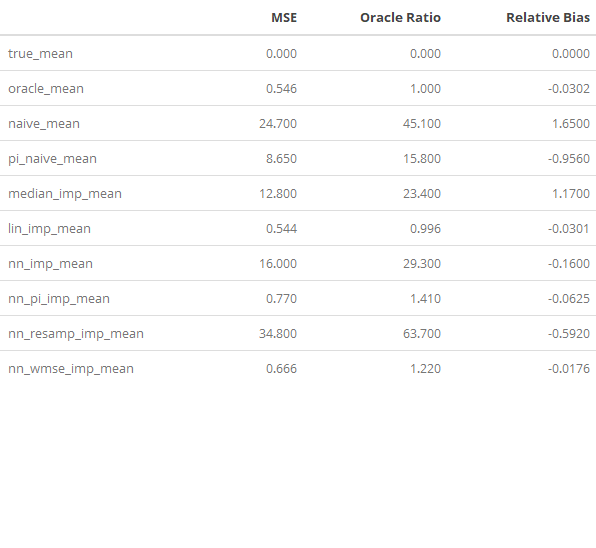

# Thesis-Research
### Fall 2018

This repository is my ongoing undergraduate research project for Reed College, advised by [Dr. Kelly McConville](https://github.com/mcconvil)

The impacts of complex survey design in the training of machine learning algorithms is an unignorable effect. This project examines multiple methods to account for complex survey design in the training of neural networks. The following methods are considered:
- **Weighted Resampling**: Data preprocess by resampling the data according to the inclusion probability of the observations.
- **Weighted Loss Function**: Weight the loss function in the training of the network by the inclusion probability of the observations.
- **Pi Feature**: Make available the inclusion probability of the observation as a feature in the training and testing of the network. 

------------------


------------------

Results for data gathered under the following generative function for label `p_y`:
```R
N = 10^6
n = 10^4
it <- 200

p_1 <- rnorm(N, mean = 10, sd = 4)
p_2 <- rnorm(N, mean = 2, sd = 4)
p_3 <- rnorm(N, mean = 5, sd = 1)

p_y_ep <- rnorm(N, mean = 0, sd = 5)
p_y <- p_1*p_2 + p_3 + p_y_ep

p_pi_ep <- rnorm(N, mean = 0, sd = 2)
temp_pi <- sqrt(p_y) + p_pi_ep
temp_pi <- rescale(temp_pi)
p_pi <- temp_pi * (n / sum(temp_pi))

p_df <- cbind(p_1, p_2, p_3, p_y, p_pi)
```


## Outline

**Chapter 1: Survey Statistics and Imputation** Introduces machine learning, neural networks, survey statistics, and the pairwise significances of these fields to the research topic.

**Chapter 2: Machine Learning and Neural Networks** Introduces machine learning building blocks such as fitting, bias-variance, and supervised learning. Neural networks discussed at length including mathematic fundamentals and properties relevant to study.

**Chapter 3: Methods and Algorithms**: February 2019.

**Chapter 4: Simulation Experiments**: March 2019.

**Chapter 5: Explorations in Real Data**: March 2019.

------------------

## File Structure

The repository is organized as follows:
- **Development**: These files are the corpus of research and experimentation with the most recent models and methods.

- **Stomping Grounds**: These files are for experimentation and developement of an R package.

- **Images**: A collection of images relevant to the hypotheses, design, and outputs of the research.

- **Thesis Writing Rmd**: Contains the R MarkDown file with the body of writing forming the Thesis Book. **Outline** describes the chapters of this file.

